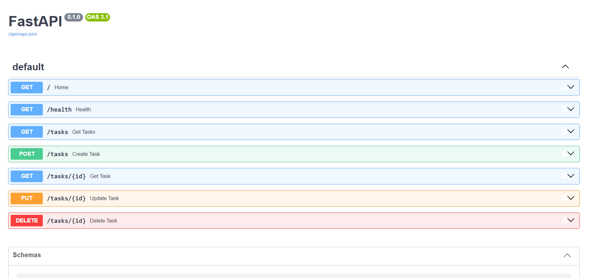

\# Task API


A small REST API built with Python and FastAPI for managing tasks.


\## What it does


The API supports full CRUD operations:


\- Create a task

\- Read all tasks

\- Read a single task

\- Update a task

\- Delete a task


Tasks are stored in memory, so data resets when the server restarts.


\## How to run


\### 1. Install dependencies


```bash

python -m pip install "fastapi\[standard]"

## Swagger UI Screenshot



## SQLite Database

The API uses SQLite for persistent task storage instead of an in-memory list.

SQLite was chosen because it stores the database in a single file, requires zero additional database setup, and keeps data persistent across server restarts.

The database is stored as:

`tasks.db`

The file is created automatically when the application starts. It is also included in `.gitignore`.

## SQL Exploration

During Stage 4, I explored the SQLite database using DB Browser for SQLite.

Example query:

```sql
SELECT * FROM tasks WHERE done = 1;


This covers the Stage 4 requirement to document one SQL query and what it returned, along with the direct-database-change verification. :contentReference[oaicite:0]{index=0}

### Then save the README

Press:

**`Ctrl + S`**

Don't commit yet.

Tell me **“saved”** once you've saved it, and I'll give you the exact Git commands for the **Stage 4 commit**.